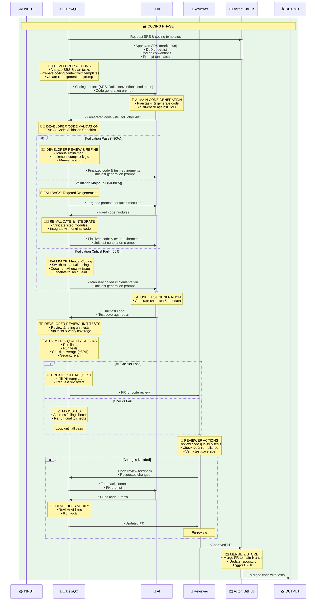

```mermaid
sequenceDiagram
    participant Input as 📥 INPUT
    participant Dev as 👨‍💻 Dev/QC
    participant AI as 🤖 AI
    participant Reviewer as 👀 Reviewer
    participant GitHub as 🗂️ Actor::GitHub
    participant Output as 📤 OUTPUT

    rect rgb(232, 245, 233)
        Note over Input,Output: 💻 CODING PHASE

        activate Dev
        Dev->>GitHub: Request SRS & coding templates
        deactivate Dev

        activate GitHub
        GitHub->>Dev: • Approved SRS (markdown)<br/>• DoD checklist<br/>• Coding conventions<br/>• Prompt templates
        deactivate GitHub

        activate Dev
        Note over Dev: 👨‍💻 DEVELOPER ACTIONS<br/>• Analyze SRS & plan tasks<br/>• Prepare coding context with templates<br/>• Create code generation prompt
        Dev->>AI: • Coding context (SRS, DoD, conventions, codebase)<br/>• Code generation prompt
        deactivate Dev

        activate AI
        Note over AI: 🤖 AI MAIN CODE GENERATION<br/>• Plan tasks & generate code<br/>• Self-check against DoD
        AI->>Dev: • Generated code with DoD checklist
        deactivate AI

        activate Dev
        Note over Dev: 👨‍💻 DEVELOPER CODE VALIDATION<br/>✅ Run AI Code Validation Checklist

        alt Validation Pass (>80%)
            Note over Dev: 👨‍💻 DEVELOPER REVIEW & REFINE<br/>• Manual refinement<br/>• Implement complex logic<br/>• Manual testing
            Dev->>AI: • Finalized code & test requirements<br/>• Unit test generation prompt
        else Validation Major Fail (50-80%)
            Note over Dev: 🔄 FALLBACK: Targeted Re-generation
            Dev->>AI: • Targeted prompts for failed modules
            deactivate Dev
            activate AI
            AI->>Dev: • Fixed code modules
            deactivate AI
            activate Dev
            Note over Dev: 👨‍💻 RE-VALIDATE & INTEGRATE<br/>• Validate fixed modules<br/>• Integrate with original code
            Dev->>AI: • Finalized code & test requirements<br/>• Unit test generation prompt
        else Validation Critical Fail (<50%)
            Note over Dev: 🚨 FALLBACK: Manual Coding<br/>• Switch to manual coding<br/>• Document AI quality issue<br/>• Escalate to Tech Lead
            Dev->>AI: • Manually coded implementation<br/>• Unit test generation prompt
        end
        deactivate Dev

        activate AI
        Note over AI: 🤖 AI UNIT TEST GENERATION<br/>• Generate unit tests & test data
        AI->>Dev: • Unit test code<br/>• Test coverage report
        deactivate AI

        activate Dev
        Note over Dev: 👨‍💻 DEVELOPER REVIEW UNIT TESTS<br/>• Review & refine unit tests<br/>• Run tests & verify coverage

        Note over Dev: 🤖 AUTOMATED QUALITY CHECKS<br/>• Run linter<br/>• Run tests<br/>• Check coverage (≥80%)<br/>• Security scan

        alt All Checks Pass
            Note over Dev: ✅ CREATE PULL REQUEST<br/>• Fill PR template<br/>• Request reviewers
            Dev->>Reviewer: • PR for code review
        else Checks Fail
            Note over Dev: ⚠️ FIX ISSUES<br/>• Address failing checks<br/>• Re-run quality checks
            Note over Dev: Loop until all pass
        end
        deactivate Dev

        activate Reviewer
        Note over Reviewer: 👀 REVIEWER ACTIONS<br/>• Review code quality & tests<br/>• Check DoD compliance<br/>• Verify test coverage

        alt Changes Needed
            Reviewer->>Dev: • Code review feedback<br/>• Requested changes
            activate Dev
            Dev->>AI: • Feedback context<br/>• Fix prompt
            deactivate Dev

            activate AI
            AI->>Dev: • Fixed code & tests
            deactivate AI

            activate Dev
            Note over Dev: 👨‍💻 DEVELOPER VERIFY<br/>• Review AI fixes<br/>• Run tests
            Dev->>Reviewer: • Updated PR
            deactivate Dev
            Note over Reviewer: Re-review
        end

        Reviewer->>GitHub: • Approved PR
        deactivate Reviewer

        activate GitHub
        Note over GitHub: 🗂️ MERGE & STORE<br/>• Merge PR to main branch<br/>• Update repository<br/>• Trigger CI/CD
        GitHub->>Output: • Merged code with tests
        deactivate GitHub
    end
```
