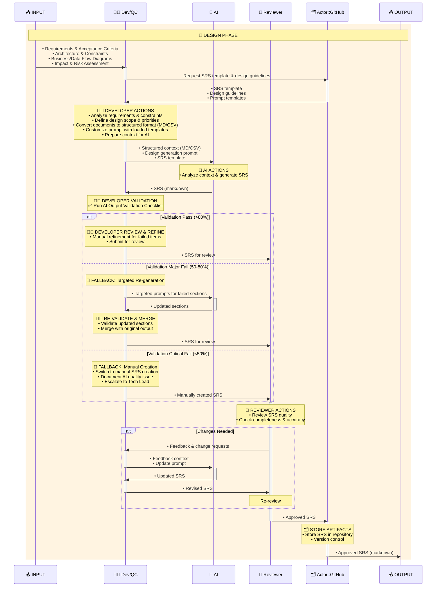

```mermaid
sequenceDiagram
    participant Input as 📥 INPUT
    participant Dev as 👨‍💻 Dev/QC
    participant AI as 🤖 AI
    participant Reviewer as 👀 Reviewer
    participant GitHub as 🗂️ Actor::GitHub
    participant Output as 📤 OUTPUT

    rect rgb(255, 244, 225)
        Note over Input,Output: 📐 DESIGN PHASE

        Input->>Dev: • Requirements & Acceptance Criteria<br/>• Architecture & Constraints<br/>• Business/Data Flow Diagrams<br/>• Impact & Risk Assessment

        activate Dev
        Dev->>GitHub: Request SRS template & design guidelines
        deactivate Dev

        activate GitHub
        GitHub->>Dev: • SRS template<br/>• Design guidelines<br/>• Prompt templates
        deactivate GitHub

        activate Dev
        Note over Dev: 👨‍💻 DEVELOPER ACTIONS<br/>• Analyze requirements & constraints<br/>• Define design scope & priorities<br/>• Convert documents to structured format (MD/CSV)<br/>• Customize prompt with loaded templates<br/>• Prepare context for AI
        Dev->>AI: • Structured context (MD/CSV)<br/>• Design generation prompt<br/>• SRS template
        deactivate Dev

        activate AI
        Note over AI: 🤖 AI ACTIONS<br/>• Analyze context & generate SRS
        AI->>Dev: • SRS (markdown)

        activate Dev
        Note over Dev: 👨‍💻 DEVELOPER VALIDATION<br/>✅ Run AI Output Validation Checklist

        alt Validation Pass (>80%)
            Note over Dev: 👨‍💻 DEVELOPER REVIEW & REFINE<br/>• Manual refinement for failed items<br/>• Submit for review
            Dev->>Reviewer: • SRS for review
        else Validation Major Fail (50-80%)
            Note over Dev: 🔄 FALLBACK: Targeted Re-generation
            Dev->>AI: • Targeted prompts for failed sections
            deactivate Dev
            activate AI
            AI->>Dev: • Updated sections
            deactivate AI
            activate Dev
            Note over Dev: 👨‍💻 RE-VALIDATE & MERGE<br/>• Validate updated sections<br/>• Merge with original output
            Dev->>Reviewer: • SRS for review
        else Validation Critical Fail (<50%)
            Note over Dev: 🚨 FALLBACK: Manual Creation<br/>• Switch to manual SRS creation<br/>• Document AI quality issue<br/>• Escalate to Tech Lead
            Dev->>Reviewer: • Manually created SRS
        end
        deactivate Dev

        activate Reviewer
        Note over Reviewer: 👀 REVIEWER ACTIONS<br/>• Review SRS quality<br/>• Check completeness & accuracy

        alt Changes Needed
            Reviewer->>Dev: • Feedback & change requests
            activate Dev
            Dev->>AI: • Feedback context<br/>• Update prompt
            deactivate Dev

            activate AI
            AI->>Dev: • Updated SRS
            deactivate AI

            activate Dev
            Dev->>Reviewer: • Revised SRS
            deactivate Dev
            Note over Reviewer: Re-review
        end

        Reviewer->>GitHub: • Approved SRS
        deactivate Reviewer

        activate GitHub
        Note over GitHub: 🗂️ STORE ARTIFACTS<br/>• Store SRS in repository<br/>• Version control
        GitHub->>Output: • Approved SRS (markdown)
        deactivate GitHub
    end
```
