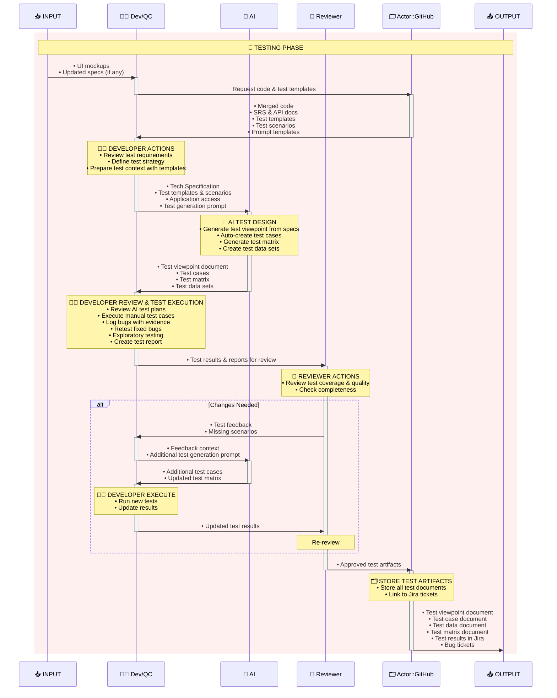

```mermaid
sequenceDiagram
    participant Input as 📥 INPUT
    participant Dev as 👨‍💻 Dev/QC
    participant AI as 🤖 AI
    participant Reviewer as 👀 Reviewer
    participant GitHub as 🗂️ Actor::GitHub
    participant Output as 📤 OUTPUT

    rect rgb(255, 240, 240)
        Note over Input,Output: 🧪 TESTING PHASE

        Input->>Dev: • UI mockups<br/>• Updated specs (if any)

        activate Dev
        Dev->>GitHub: Request code & test templates
        deactivate Dev

        activate GitHub
        GitHub->>Dev: • Merged code<br/>• SRS & API docs<br/>• Test templates<br/>• Test scenarios<br/>• Prompt templates
        deactivate GitHub

        activate Dev
        Note over Dev: 👨‍💻 DEVELOPER ACTIONS<br/>• Review test requirements<br/>• Define test strategy<br/>• Prepare test context with templates
        Dev->>AI: • Tech Specification<br/>• Test templates & scenarios<br/>• Application access<br/>• Test generation prompt
        deactivate Dev

        activate AI
        Note over AI: 🤖 AI TEST DESIGN<br/>• Generate test viewpoint from specs<br/>• Auto-create test cases<br/>• Generate test matrix<br/>• Create test data sets
        AI->>Dev: • Test viewpoint document<br/>• Test cases<br/>• Test matrix<br/>• Test data sets
        deactivate AI

        activate Dev
        Note over Dev: 👨‍💻 DEVELOPER REVIEW & TEST EXECUTION<br/>• Review AI test plans<br/>• Execute manual test cases<br/>• Log bugs with evidence<br/>• Retest fixed bugs<br/>• Exploratory testing<br/>• Create test report
        Dev->>Reviewer: • Test results & reports for review
        deactivate Dev

        activate Reviewer
        Note over Reviewer: 👀 REVIEWER ACTIONS<br/>• Review test coverage & quality<br/>• Check completeness

        alt Changes Needed
            Reviewer->>Dev: • Test feedback<br/>• Missing scenarios
            activate Dev
            Dev->>AI: • Feedback context<br/>• Additional test generation prompt
            deactivate Dev

            activate AI
            AI->>Dev: • Additional test cases<br/>• Updated test matrix
            deactivate AI

            activate Dev
            Note over Dev: 👨‍💻 DEVELOPER EXECUTE<br/>• Run new tests<br/>• Update results
            Dev->>Reviewer: • Updated test results
            deactivate Dev
            Note over Reviewer: Re-review
        end

        Reviewer->>GitHub: • Approved test artifacts
        deactivate Reviewer

        activate GitHub
        Note over GitHub: 🗂️ STORE TEST ARTIFACTS<br/>• Store all test documents<br/>• Link to Jira tickets
        GitHub->>Output: • Test viewpoint document<br/>• Test case document<br/>• Test data document<br/>• Test matrix document<br/>• Test results in Jira<br/>• Bug tickets
        deactivate GitHub
    end
```
